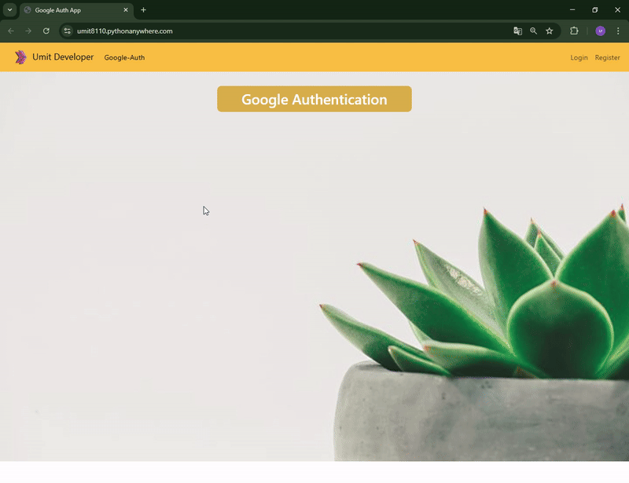

<!-- Please update value in the {}  -->

<h1 align="center">🔐 Google Authentication API <br/>
Django Allauth
</h1>

<p align="center"><strong>🔑 An application that provides user authentication via Google account with Django
 🔑</strong></p>

<div align="center">
  <h3>
    <a href="https://umit8110.pythonanywhere.com/">
      Live Demo
    </a> 
  </h3>
</div>

<!-- TABLE OF CONTENTS -->

## Table of Contents
- [Table of Contents](#table-of-contents)
- [About This Project](#about-this-project)
- [Overview](#overview)
- [Built With](#built-with)
- [How To Use](#how-to-use)
- [Key Features](#key-features)
- [Contact](#contact)


## About This Project

This project allows users to easily register and log in via their Google account with Django. 
Its main features are:

- Fast and secure authentication with Google account.
- Support registration and login with traditional username and password.
- Social authentication management with Django Allauth.
- User-friendly message notifications and stylish design with Bootstrap.

<!-- OVERVIEW -->

## Overview

<!--  -->
<div align="center">
  
</div>
<p align="center">
  ➡ The screen where users log in with their Google accounts and access the home page.
</p>


## Built With

<!-- This section should list any major frameworks that you built your project using. Here are a few examples.-->
This project was developed using the following tools and libraries:

- [Django Templates](https://docs.djangoproject.com/en/5.1/topics/templates/): For creating dynamic web pages.
- [Bootstrap5](https://getbootstrap.com/docs/5.0/getting-started/introduction/): To provide a responsive and modern user interface.
- [django-crispy-forms](https://django-crispy-forms.readthedocs.io/en/latest/): To easily style forms.
- [django-allauth](https://django-allauth.readthedocs.io/en/latest/index.html) - Social Account Authentication Management


## How To Use

<!-- This is an example, please update according to your application -->

To clone and run this application, you'll need [Git](https://github.com/Umit8098/Project_Django_Templates_Todo_App_FB_Authantication-1_CH-11)

When installing the required packages in the requirements.txt file, review the package differences for windows/macOS/Linux environments. 

Complete the installation by uncommenting the appropriate package.

```bash
# Clone this repository
$ git clone https://github.com/Umit8098/Project_Django_Templates_Todo_App_FB_Authantication-1_CH-11.git

# Install dependencies
    $ python -m venv env
    $ python3 -m venv env (for macOs/linux OS)
    $ env/Scripts/activate (for win OS)
    $ source env/bin/activate (for macOs/linux OS)
    $ pip install -r requirements.txt
    $ python manage.py migrate (for win OS)
    $ python3 manage.py migrate (for macOs/linux OS)

# Create and Edit .env
# Add Your SECRET_KEY in .env file

# Google API Ayarları

For Google authentication, follow these steps:
Google kimlik doğrulaması için şu adımları takip edin:

1. [Google API Console](https://console.cloud.google.com/) Go to and create a new project.
2. "OAuth Consent Screen" configure settings.
3. Get `GOOGLE_CLIENT_ID` and `GOOGLE_SECRET` information from the "Credentials" tab.
4. Add this information to your `.env` file.


"""
# example .env;

SECRET_KEY =123456789abcdefg...

GOOGLE_CLIENT_ID={YOUR_GOOGLE_CLIENT_ID}
GOOGLE_SECRET={YOUR_GOOGLE_SECRET}

"""

# Run the app
    $ python manage.py runserver
```

## Key Features

- **Authentication with Google Account**: Users can quickly log in using their Google account.
- **Traditional Authentication**: Support user registration and login with email and password.
- **Profile Management**: Registered users can edit account information.
- **User Notifications**: Feedback is provided about the actions taken.


## Contact

<!-- - Website [your-website.com](https://{your-web-site-link}) -->
- GitHub [@Umit8098](https://github.com/Umit8098)

- Linkedin [@umit-arat](https://linkedin.com/in/umit-arat/)
<!-- - Twitter [@your-twitter](https://{twitter.com/your-username}) -->
